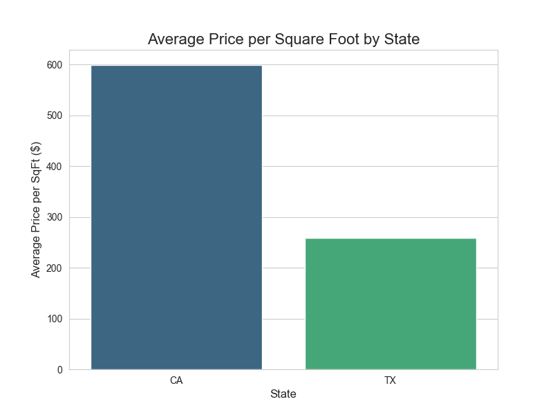
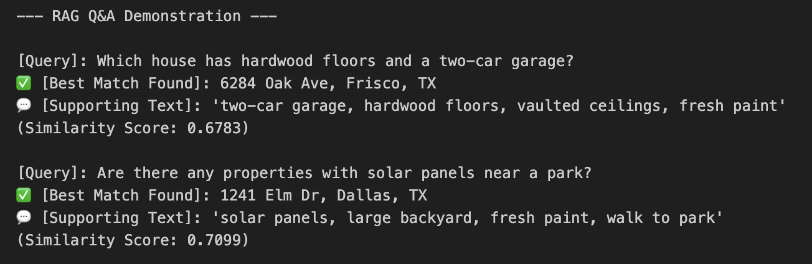

# Results Summary: Snaphomz Trial

### Executive Summary
This project successfully analyzed property listings, built a predictive price model, and developed an AI-powered Q&A feature. 

The analysis revealed significant price differences between markets, and the AI feature proved effective at extracting specific details from unstructured text descriptions.

### Key Insight: Market Value Disparity
Exploratory Data Analysis immediately highlighted a stark contrast in property values between *California* and *Texas*. As shown below, the average price per square foot in California is substantially higher.

### LLM Feature: Semantic Q&A
A local AI model was used to create a semantic search feature. The system can understand a natural language question and find the most relevant property listing from the `remarks` column, returning the supporting text as evidence. 

